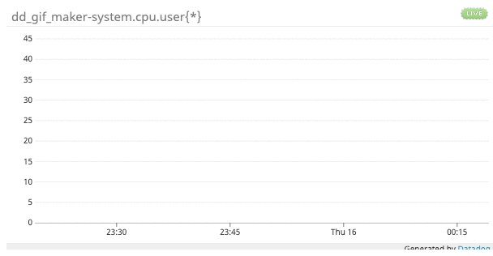

# dd gif maker

make gifs of your dd timeseries queries

## setup

- clone repository
- run `brew install imagemagick`
- run `brew install graphicsmagick`
- run `npm install`
- add your Datadog `API_KEY` and `APP_KEY` to the `.env` file in this repository. DatadogHQ is a monitoring platform that's free to sign up for at `https://www.datadoghq.com/`.

## example usage

```
dd_gif_maker $ node index.js --q='system.cpu.user{*}' --n="example_timeseries_viz" --a="avg" --t="1_hour"

=>
dd embed id: xxxxx7472
successfully revoked dd embed id: xxxxx7472
done creating example_timeseries_viz.gif
done deleting snapshot pngs
```

### example gif output



### TODO
- queries with multiple lines
- multiple queries
- area charts (bar charts are canvas, probably out of scope)
- event overlay
- template variables